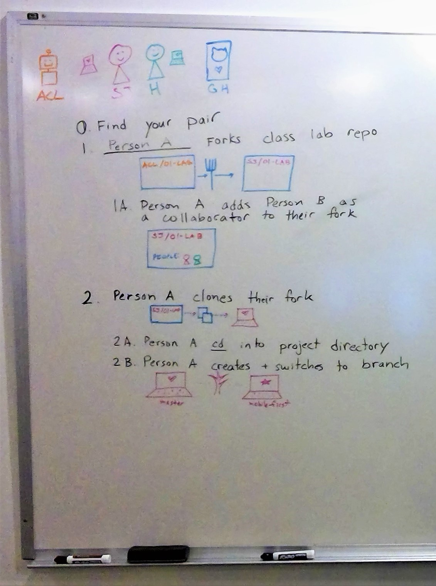
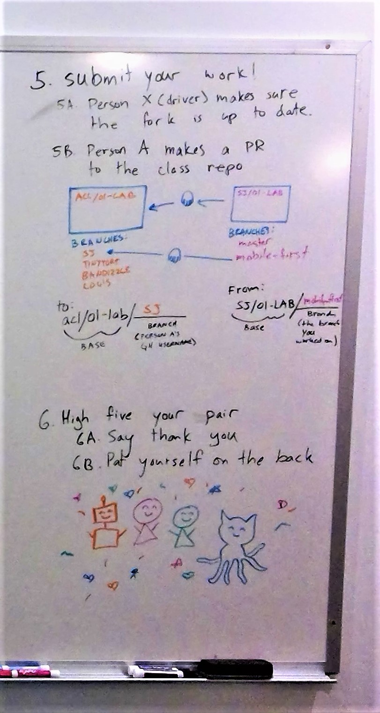

# Submitting your labs

- [Visual](#Visual)
- [Written steps](#Written-steps)

===

## Visual

 

 

## Written steps
#### [w/ relevant example commands]

0. Find your pair
1. Person A forks class lab repo `[done via GitHub website: Fork]`
    * 1A. Person A adds Person B as a collaborator to their fork
        *  `[done via GitHub website: Settings > Collaborators & teams > Add collaborator]`
2. Person A clones their fork  `[git clone https://github.com/acl-301d-fall-2017/submit-process.git]`
    * 2A. Person A cd into the project directory `[cd submit-process]`
    * 2B. Person A creates and switches to branch `[git checkout -b clearerDescriptions]`
3. Person A drives for X minutes
    * 3A. Work
    * 3B. Add and commit
        * `[git add .]`
        * `[git commit -m 'remove passive voice']`
    * 3C. Push
        * `[git push origin clearerDescriptions]`
4. Person B demands to drive (kindly)
    * 4A. Person A makes sure their fork is up to date
        * `[git push origin clearerDescriptions]`
    * 4B. Person B clones Person A's fork
        * `[git clone https://github.com/sajoy/submit-process.git]`
        * **NOTE:** the username is the person's username, **NOT** the class org
    * 4C. Person B cd into the project directory
        * `[cd submit-process]`
    * 4D. Person B fetches and switches to branch
        *  `[git fetch origin clearerDescriptions]`
        *  `[git checkout clearerDescriptions]`
    * 4E. Repeat Step 3's cycle as Person B
5. Submit your work!
    * 5A. Person X (whoever is driving) makes sure the fork is up to date
        * `[git push origin clearerDescriptions]`
    * 5B. Person A makes a PR to the class repo
        * `[done via GitHub website: New pull request]`
        * The base should be: github.com/acl-301d-fall-2017/submit-process
            * To branch: `sajoy` (your GitHub username)
        * The head fork should be: github.com/sajoy/submit-process
            * From branch: `clearerDescriptions`
6. High five your pair
    * 6A. Say thank you
    * 6B. Pat yourself on the back